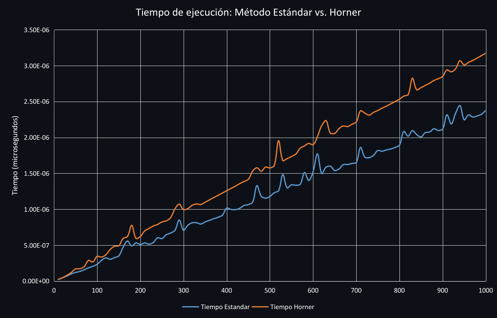

# 🦊 Comparación de Metodos para Evaluar Polinomios

[](LICENSE) 

Este proyecto compara el rendimiento de dos métodos para evaluar polinomios: 

<details>
<summary><strong> Método Estándar</strong></summary>

P(x) = a₀ + a₁x + a₂x² + ⋯ + aₙxⁿ  

Utiliza una multiplicación por cada potencia de x.  

</details>

<details>
<summary><strong> Método de Horner</strong></summary>

P(x) = (⋯((aₙx + aₙ₋₁)x + aₙ₋₂)x + ⋯ + a₀)  

Este método reduce significativamente el número de multiplicaciones y sumas.  

</details> 

Midiendo el tiempo promedio de ejecución en milisegundos para diferentes grados de polinomio.

## 👨‍💻 Autor

Nombre del estudiante: Daniel Leinad Dominguez Calvario


## 📋 Requisitos

- **C++20**
- **g++ Compiler 10.2 o superior**
- **CMake** (opcional)

## 🔽 Compilación y Ejecución

### Compilación Manual
1. Clona el repositorio:
   ```bash
   git clone https://github.com/DashyDaFur/Comparacion-Evaluacion-Polinomios.git
   cd Comparacion-Evaluacion-Polinomios
   ```
2. Compila el código:
   ```bash
   g++ -o evaluador src/main.cpp src/aux.cpp src/metodos.cpp -std=c++20
   ```
3. Ejecuta el programa:
   ```bash
   ./evaluador
   ```

### Uso de CMake
1. Clona el repositorio:
   ```bash
   git clone https://github.com/DashyDaFur/Comparacion-Evaluacion-Polinomios.git
   cd Comparacion-Evaluacion-Polinomios
  ```

2. Crea un directorio de compilación y compila el proyecto:
   ```bash
   mkdir build
   cd build
   cmake ..
   make
   ```
3. Ejecuta el programa:
   ```bash
   ./evaluador
   ```
	

## 🌳 Estructura del Proyecto  
- **Carpeta `src`**: Contiene los archivos `.cpp` y `.hpp`.  
- **Carpeta `img`**: Contiene todas las imágenes utilizadas en este repositorio.
- **Carpeta `data`**: Contiene el archivo csv generado para el analisis.
- **`README.md`**: Contiene una descripción general del proyecto.
- **`LICENSE`**: Contiene la licencia MIT.
- **`CMakeLists.txt`**: Contiene la configuracion en caso del uso de CMake
- **`.gitignore`**: Excluye archivos generados.

## 🛠️ Configuración

Puedes modificar las siguientes constantes en `main.cpp` para ajustar el programa:  

- `PRUEBAS`: Número de pruebas por grado de polinomio.  
- `GRADO_MAXIMO`: Grado máximo del polinomio a evaluar.  
- `INTERVALO_GRADO`: Incremento entre grados evaluados.  

## 📈 Experimentacion y Grafica Comparativa

Se midió el tiempo promedio que toma evaluar un polinomio de grado `n` en un punto aleatorio no nulo `x ∈ [−10, 10]`, repitiendo el experimento 1000 veces por cada grado desde 10 hasta 1000 con incrementos de 10.  

**Archivo generado**:  
`data/tiempos_polinomios.csv`  

La siguiente gráfica muestra el rendimiento promedio de ambos métodos:  

 

  

## 📊 Análisis de Resultados  
- El método de Horner es **consistentemente más rápido** que el método estándar.  
- Ambos tienen complejidad `O(n)`, pero Horner realiza **menos multiplicaciones**.  

## ✅ Conclusiones  
1. **Horner supera ampliamente** al método estándar, especialmente en polinomios de alto grado.  
2. La **optimización algorítmica** impacta significativamente incluso en tareas simples.  

## 📜 Licencia  
Este proyecto está bajo la licencia [MIT](LICENSE).
